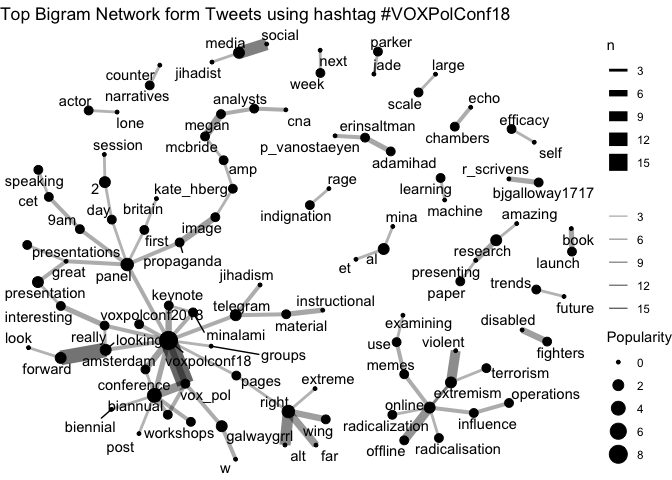

Vox-Pol Conf Twitter Analysis
================
Simon
2018-08-21

This is a short notebook scraping tweets related to the Vox-Pol Conference 2018 in Amsterdam. As this was again a very inspiring Vox-Pol event I thought it was time to further explore the twitter community.

Packages
--------

Load the necessary packages

``` r
# install pacman once if not avaible on your machine
# install.packages("pacman")
pacman::p_load(tidyverse, purrr, tidyr, rtweet, stringr, ggraph, igraph, tidygraph, forcats)
```

Get Data
--------

Call Twitter API. If you want to scrape data yourself you have to register a free account where you get your personal access point to Twitter. Check out [`rtweet`](https://github.com/mkearney/rtweet/) on github and follow their instructions to the twitter authentication.

``` r
twitter_token <- readRDS("twitter_token.rds")

## search for 18000 tweets using the rstats hashtag
rt <- search_tweets(
  "#VOXPolConf18 OR #VOXPolConf2018", n = 2000, include_rts = T, retryonratelimit = T
)
save(rt, file = "rt.Rdata")
```

Lets first look at the data structure and column names. Twitter returns a huge amount of data.

``` r
load("rt.Rdata")
rt %>% 
  glimpse
```

    ## Observations: 1,153
    ## Variables: 87
    ## $ user_id                 <chr> "158952098", "4785928097", "8264655259...
    ## $ status_id               <chr> "1028662031900192769", "10286657265660...
    ## $ created_at              <dttm> 2018-08-12 15:18:34, 2018-08-12 15:33...
    ## $ screen_name             <chr> "derekcrim", "WojKaczkowski", "Heartof...
    ## $ text                    <chr> "RT @VOX_Pol: ICYMI, revised programme...
    ## $ source                  <chr> "Twitter for iPhone", "Twitter for And...
    ## $ display_text_width      <dbl> 140, 140, 140, 279, 140, 140, 140, 140...
    ## $ reply_to_status_id      <chr> NA, NA, NA, NA, NA, NA, NA, NA, NA, NA...
    ## $ reply_to_user_id        <chr> NA, NA, NA, NA, NA, NA, NA, NA, NA, NA...
    ## $ reply_to_screen_name    <chr> NA, NA, NA, NA, NA, NA, NA, NA, NA, NA...
    ## $ is_quote                <lgl> FALSE, FALSE, FALSE, FALSE, FALSE, FAL...
    ## $ is_retweet              <lgl> TRUE, TRUE, TRUE, FALSE, TRUE, TRUE, T...
    ## $ favorite_count          <int> 0, 0, 0, 3, 0, 0, 0, 0, 4, 0, 0, 20, 0...
    ## $ retweet_count           <int> 15, 8, 15, 3, 3, 3, 3, 15, 2, 2, 2, 7,...
    ## $ hashtags                <list> ["voxpolconf18", "voxpolconf18", "vox...
    ## $ symbols                 <list> [NA, NA, NA, NA, NA, NA, NA, NA, NA, ...
    ## $ urls_url                <list> ["voxpol.eu/wp-content/upl…", NA, "vo...
    ## $ urls_t.co               <list> ["https://t.co/oXMCT4g5zj", NA, "http...
    ## $ urls_expanded_url       <list> ["https://www.voxpol.eu/wp-content/up...
    ## $ media_url               <list> [NA, NA, NA, "http://pbs.twimg.com/me...
    ## $ media_t.co              <list> [NA, NA, NA, "https://t.co/ufAVloDGAO...
    ## $ media_expanded_url      <list> [NA, NA, NA, "https://twitter.com/VOX...
    ## $ media_type              <list> [NA, NA, NA, "photo", NA, NA, NA, NA,...
    ## $ ext_media_url           <list> [NA, NA, NA, "http://pbs.twimg.com/me...
    ## $ ext_media_t.co          <list> [NA, NA, NA, "https://t.co/ufAVloDGAO...
    ## $ ext_media_expanded_url  <list> [NA, NA, NA, "https://twitter.com/VOX...
    ## $ ext_media_type          <chr> NA, NA, NA, NA, NA, NA, NA, NA, NA, NA...
    ## $ mentions_user_id        <list> ["2340767688", <"413366295", "2340767...
    ## $ mentions_screen_name    <list> ["VOX_Pol", <"cldaymon", "VOX_Pol">, ...
    ## $ lang                    <chr> "en", "en", "en", "en", "en", "en", "e...
    ## $ quoted_status_id        <chr> NA, NA, NA, NA, NA, NA, NA, NA, NA, NA...
    ## $ quoted_text             <chr> NA, NA, NA, NA, NA, NA, NA, NA, NA, NA...
    ## $ quoted_created_at       <dttm> NA, NA, NA, NA, NA, NA, NA, NA, NA, N...
    ## $ quoted_source           <chr> NA, NA, NA, NA, NA, NA, NA, NA, NA, NA...
    ## $ quoted_favorite_count   <int> NA, NA, NA, NA, NA, NA, NA, NA, NA, NA...
    ## $ quoted_retweet_count    <int> NA, NA, NA, NA, NA, NA, NA, NA, NA, NA...
    ## $ quoted_user_id          <chr> NA, NA, NA, NA, NA, NA, NA, NA, NA, NA...
    ## $ quoted_screen_name      <chr> NA, NA, NA, NA, NA, NA, NA, NA, NA, NA...
    ## $ quoted_name             <chr> NA, NA, NA, NA, NA, NA, NA, NA, NA, NA...
    ## $ quoted_followers_count  <int> NA, NA, NA, NA, NA, NA, NA, NA, NA, NA...
    ## $ quoted_friends_count    <int> NA, NA, NA, NA, NA, NA, NA, NA, NA, NA...
    ## $ quoted_statuses_count   <int> NA, NA, NA, NA, NA, NA, NA, NA, NA, NA...
    ## $ quoted_location         <chr> NA, NA, NA, NA, NA, NA, NA, NA, NA, NA...
    ## $ quoted_description      <chr> NA, NA, NA, NA, NA, NA, NA, NA, NA, NA...
    ## $ quoted_verified         <lgl> NA, NA, NA, NA, NA, NA, NA, NA, NA, NA...
    ## $ retweet_status_id       <chr> "1027835283415478272", "10276542038529...
    ## $ retweet_text            <chr> "ICYMI, revised programme for #voxpolc...
    ## $ retweet_created_at      <dttm> 2018-08-10 08:33:22, 2018-08-09 20:33...
    ## $ retweet_source          <chr> NA, NA, NA, NA, NA, NA, NA, NA, NA, NA...
    ## $ retweet_favorite_count  <int> 10, 26, 10, NA, 3, 3, 3, 10, NA, 4, 4,...
    ## $ retweet_retweet_count   <int> 15, 8, 15, NA, 3, 3, 3, 15, NA, 2, 2, ...
    ## $ retweet_user_id         <chr> "2340767688", "413366295", "2340767688...
    ## $ retweet_screen_name     <chr> "VOX_Pol", "cldaymon", "VOX_Pol", NA, ...
    ## $ retweet_name            <chr> "VOX-Pol", "Chelsea Daymon", "VOX-Pol"...
    ## $ retweet_followers_count <int> 3084, 1680, 3084, NA, 3084, 3084, 3084...
    ## $ retweet_friends_count   <int> 88, 1210, 88, NA, 88, 88, 88, 88, NA, ...
    ## $ retweet_statuses_count  <int> 3470, 7997, 3470, NA, 3470, 3470, 3470...
    ## $ retweet_location        <chr> "", "Somewhere out there...", "", NA, ...
    ## $ retweet_description     <chr> "We're a EU FP7-funded academic networ...
    ## $ retweet_verified        <lgl> FALSE, FALSE, FALSE, NA, FALSE, FALSE,...
    ## $ place_url               <chr> NA, NA, NA, NA, NA, NA, NA, NA, NA, NA...
    ## $ place_name              <chr> NA, NA, NA, NA, NA, NA, NA, NA, NA, NA...
    ## $ place_full_name         <chr> NA, NA, NA, NA, NA, NA, NA, NA, NA, NA...
    ## $ place_type              <chr> NA, NA, NA, NA, NA, NA, NA, NA, NA, NA...
    ## $ country                 <chr> NA, NA, NA, NA, NA, NA, NA, NA, NA, NA...
    ## $ country_code            <chr> NA, NA, NA, NA, NA, NA, NA, NA, NA, NA...
    ## $ geo_coords              <list> [<NA, NA>, <NA, NA>, <NA, NA>, <NA, N...
    ## $ coords_coords           <list> [<NA, NA>, <NA, NA>, <NA, NA>, <NA, N...
    ## $ bbox_coords             <list> [<NA, NA, NA, NA, NA, NA, NA, NA>, <N...
    ## $ name                    <chr> "Derek Silva", "Wojciech Kaczkowski", ...
    ## $ location                <chr> "London, Ontario", "Decatur, GA", "", ...
    ## $ description             <chr> "Assistant Professor of Criminology @k...
    ## $ url                     <chr> "https://t.co/cU5LSgtqwV", NA, "https:...
    ## $ protected               <lgl> FALSE, FALSE, FALSE, FALSE, FALSE, FAL...
    ## $ followers_count         <int> 4462, 93, 66, 3084, 433, 964, 317, 376...
    ## $ friends_count           <int> 3836, 73, 105, 88, 1455, 311, 630, 298...
    ## $ listed_count            <int> 39, 2, 1, 86, 3, 26, 153, 140, 86, 178...
    ## $ statuses_count          <int> 1764, 80, 420, 3470, 3298, 3393, 17555...
    ## $ favourites_count        <int> 2867, 148, 246, 259, 1836, 3267, 3516,...
    ## $ account_created_at      <dttm> 2010-06-24 02:32:24, 2016-01-12 16:50...
    ## $ verified                <lgl> FALSE, FALSE, FALSE, FALSE, FALSE, FAL...
    ## $ profile_url             <chr> "https://t.co/cU5LSgtqwV", NA, "https:...
    ## $ profile_expanded_url    <chr> "http://www.dereksilva.org", NA, "http...
    ## $ account_lang            <chr> "en", "en", "it", "en", "en-gb", "en",...
    ## $ profile_banner_url      <chr> "https://pbs.twimg.com/profile_banners...
    ## $ profile_background_url  <chr> "http://abs.twimg.com/images/themes/th...
    ## $ profile_image_url       <chr> "http://pbs.twimg.com/profile_images/8...

Timeline
--------

What was the best time to tweet?

``` r
rt %>%
  ## parse date format
  mutate(
    cdate = created_at %>% 
      str_extract("\\d{4}-\\d{2}-\\d{2}") %>% 
      lubridate::ymd(),
    hour = lubridate::hour(created_at)
  ) %>%
  ## select relevant time period
  filter(cdate >= as.Date("2018-08-19")) %>% 
  ## count tweet per and and hour
  group_by(cdate, hour) %>%
  tally %>%
  ungroup %>%
  ggplot(aes(hour, n)) +
  geom_line() +
  ## split the visualization 
  facet_wrap(~cdate, nrow = 3) +
  theme_minimal() +
  ggtitle("Number of Tweets by Day and Hour")
```


Retweet Network
---------------

``` r
rt_graph <- rt %>% 
  ## select relevant variables
  dplyr::select(screen_name, mentions_screen_name) %>% 
  ## unnest list of mentions_screen_name
  unnest %>% 
  ## count the number of coocurences
  group_by(screen_name, mentions_screen_name) %>% 
  tally(sort = T) %>%
  ungroup %>% 
  ## drop missing values
  drop_na %>% 
  ## iflter those coocurences that appear at least 2 times
  filter(n > 1) %>% 
  ## transforming the dataframe to a graph object
  as_tbl_graph() %>% 
  ## calculating node centrality
  mutate(popularity = centrality_degree(mode = 'in'))

rt_graph %>% 
  ## create graph layout
  ggraph(layout = "kk") + 
  ## define edge aestetics
  geom_edge_link(aes(alpha = n, edge_width = n), show.legend = FALSE) + 
  ## scale down link saturation
  scale_edge_alpha(range = c(.1, .7)) +
  ## define note size param
  geom_node_point(aes(size = popularity)) +
  ## define node labels
  geom_node_text(aes(label = name), repel = T) +
  ## equal width and height
  coord_fixed() +
  ## plain theme
  theme_void() +
  ## title
  ggtitle("#VOXPolConf18 Tweets and Retweets")
```


Most Frequent Hashtags
----------------------

``` r
rt_hashtags <- rt %>% 
  select(hashtags) %>% 
  ## unnest list of hastags
  unnest %>% 
    na.omit %>% 
  ## clean hashtags
  mutate(hashtags = stringr::str_to_lower(hashtags) %>% 
           str_replace_all("2018", "18") %>% 
           ## add #symbol to vector
           paste0("#", .)) %>% 
  ## count each hashtag and sort
  count(hashtags, sort = T) %>% 
  filter(n > 2)

rt_hashtags %>% 
  filter(hashtags != "#voxpolconf18") %>%
  mutate(hashtags = forcats::fct_reorder(hashtags, n)) %>% 
  ggplot(aes(hashtags, n)) +
  geom_bar(stat = "identity", alpha = .7) +
  coord_flip() +
  theme_minimal() +
  ggtitle("Most Frequent Hastags related to #voxpolconf18")
```


Most Frequent Bigram Network
----------------------------

``` r
gg_bigram <- rt %>%
  select(text) %>% 
  ## remove text noise
  mutate(text = stringr::str_remove_all(text, "w |amp ")) %>% 
  ## remove retweets
  filter(!stringr::str_detect(text, "^RT")) %>% 
  ## remove urls
  mutate(text = stringr::str_remove_all(text, "https?[:]//[[:graph:]]+")) %>% 
  mutate(id = 1:n()) %>% 
  ## split text into words
  tidytext::unnest_tokens(word, text, token = "words") %>% 
  ## remove stop words
  anti_join(tidyTX::stop_words_en) %>% 
  ## paste words to text by id
  group_by(id) %>% 
  summarise(text = paste(word, collapse = " ")) %>% 
  ungroup %>% 
  ## again split text into bigrams (word occurences or collocations)
  tidytext::unnest_tokens(bigram, text, token = "ngrams", n = 2) %>% 
  separate(bigram, c("word1", "word2"), sep = " ") %>% 
  ## count bigrams
  count(word1, word2, sort = T) %>% 
  ## select first 90
  slice(1:90) %>% 
  drop_na() %>%
  ## create tidy graph object
  as_tbl_graph() %>% 
  ## calculate node centrality
  mutate(Popularity = centrality_degree(mode = 'in'))
```

``` r
gg_bigram %>% 
  ggraph() +
  geom_edge_link(aes(edge_alpha = n, edge_width = n)) +
  geom_node_point(aes(size = Popularity)) + 
  geom_node_text(aes(label = name),  repel = TRUE) +
  theme_void() +
  scale_edge_alpha("", range = c(0.3, .6)) +
  ggtitle("Top Bigram Network form Tweets using hashtag #VOXPolConf18")
```



``` r
sessionInfo()
```

    ## R version 3.5.0 (2018-04-23)
    ## Platform: x86_64-apple-darwin15.6.0 (64-bit)
    ## Running under: macOS High Sierra 10.13.5
    ## 
    ## Matrix products: default
    ## BLAS: /Library/Frameworks/R.framework/Versions/3.5/Resources/lib/libRblas.0.dylib
    ## LAPACK: /Library/Frameworks/R.framework/Versions/3.5/Resources/lib/libRlapack.dylib
    ## 
    ## locale:
    ## [1] de_DE.UTF-8/de_DE.UTF-8/de_DE.UTF-8/C/de_DE.UTF-8/de_DE.UTF-8
    ## 
    ## attached base packages:
    ## [1] stats     graphics  grDevices utils     datasets  methods   base     
    ## 
    ## other attached packages:
    ##  [1] bindrcpp_0.2.2    tidygraph_1.1.0   igraph_1.2.2     
    ##  [4] ggraph_1.0.1.9999 rtweet_0.6.20     forcats_0.3.0    
    ##  [7] stringr_1.3.1     dplyr_0.7.6       purrr_0.2.5      
    ## [10] readr_1.1.1       tidyr_0.8.1       tibble_1.4.2     
    ## [13] ggplot2_3.0.0     tidyverse_1.2.1  
    ## 
    ## loaded via a namespace (and not attached):
    ##  [1] ggrepel_0.8.0     Rcpp_0.12.18      lubridate_1.7.4  
    ##  [4] lattice_0.20-35   deldir_0.1-15     assertthat_0.2.0 
    ##  [7] rprojroot_1.3-2   digest_0.6.15     psych_1.8.4      
    ## [10] ggforce_0.1.1     R6_2.2.2          cellranger_1.1.0 
    ## [13] plyr_1.8.4        backports_1.1.2   evaluate_0.10.1  
    ## [16] httr_1.3.1        pillar_1.2.3      rlang_0.2.1      
    ## [19] lazyeval_0.2.1    readxl_1.1.0      rstudioapi_0.7   
    ## [22] Matrix_1.2-14     rmarkdown_1.9     labeling_0.3     
    ## [25] tidytext_0.1.8    foreign_0.8-70    polyclip_1.9-1   
    ## [28] munsell_0.5.0     broom_0.4.5       janeaustenr_0.1.5
    ## [31] compiler_3.5.0    modelr_0.1.2      pkgconfig_2.0.1  
    ## [34] mnormt_1.5-5      htmltools_0.3.6   openssl_1.0.1    
    ## [37] tidyselect_0.2.4  gridExtra_2.3     viridisLite_0.3.0
    ## [40] crayon_1.3.4      withr_2.1.2       SnowballC_0.5.1  
    ## [43] MASS_7.3-49       grid_3.5.0        nlme_3.1-137     
    ## [46] jsonlite_1.5      gtable_0.2.0      pacman_0.4.6     
    ## [49] magrittr_1.5      concaveman_1.0.0  tokenizers_0.2.1 
    ## [52] scales_1.0.0      cli_1.0.0         stringi_1.2.4    
    ## [55] farver_1.0        reshape2_1.4.3    viridis_0.5.1    
    ## [58] tidyTX_0.1.0      xml2_1.2.0        tools_3.5.0      
    ## [61] glue_1.3.0        tweenr_0.1.5.9999 hms_0.4.2        
    ## [64] parallel_3.5.0    yaml_2.1.19       colorspace_1.3-2 
    ## [67] rvest_0.3.2       knitr_1.20        bindr_0.1.1      
    ## [70] haven_1.1.2
